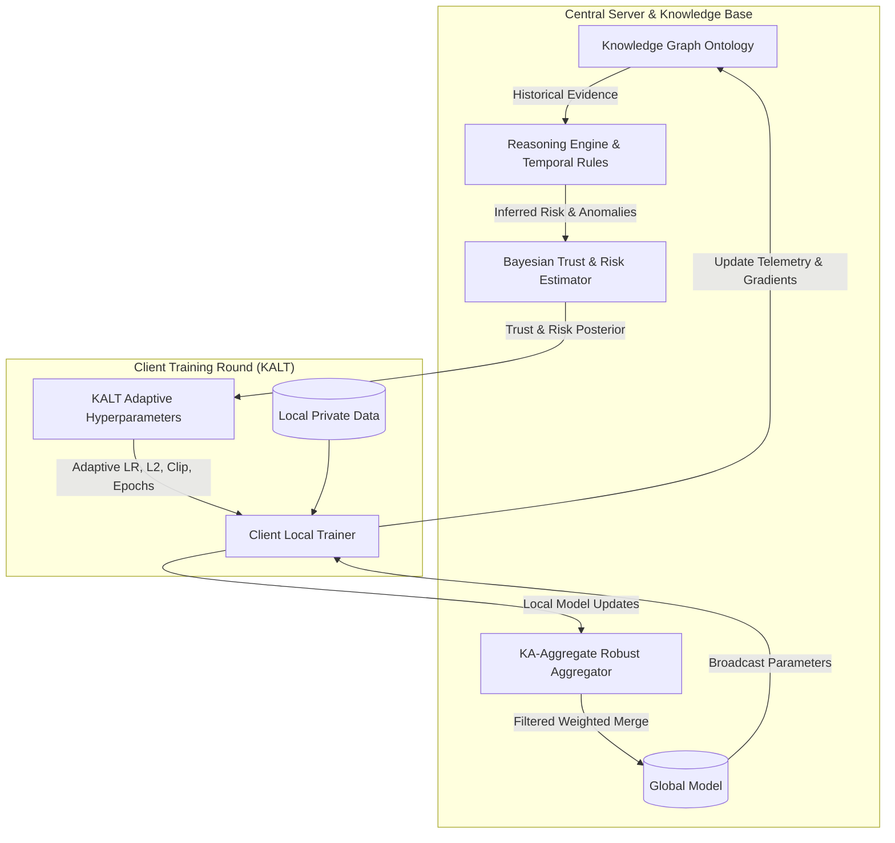

# Secure Federated Learning: Knowledge-Aware Trust & Risk Assessment Framework

[](https://www.python.org/)
[](LICENSE)
[-orange.svg)](https://www.sciencedirect.com/journal/knowledge-based-systems)
[](https://numpy.org/)

Official implementation of **"A Knowledge-Aware Trust and Risk Assessment Framework for Secure Federated Learning"**.

This framework introduces an ontology-grounded Knowledge Graph (KG), rule-based reasoning engine, Bayesian trust modeling, and a novel **Knowledge-Aware Adaptive Local Trainer (KALT)**. Unlike conventional defense mechanisms that operate purely *post-hoc* at aggregation time, our framework establishes a **bidirectional closed feedback loop** between the Knowledge Base and client local optimization.

---

## 📌 Key Highlights

- **Bidirectional Closed-Loop Defense**: Pre-hoc local parameter adaptation via KALT + Post-hoc aggregation filtering via KA-Aggregate.
- **Formal Knowledge Graph Ontology**: Typed semantic entities (`Client`, `Update`, `Evidence`, `Anomaly`, `TrustScore`, `RiskScore`, `Round`) and relations for continuous behavioral tracking across FL rounds.
- **Rule-Based Reasoning Engine**: Multi-factor anomaly scoring combined with 14 prioritized attack inference rules (R01–R14) and 4 temporal behavioral escalation rules (R15–R18).
- **Bayesian Trust & Temporal Tracking**: Beta-Binomial trust posterior updates ($\hat{\tau}_{c,r}, \sigma^2$) combined with exponential moving averages (EMA), trend slopes, and anomaly streak detection.
- **KALT (Knowledge-Aware Adaptive Local Trainer)**: Dynamically adjusts local learning rate ($\eta^*$), L2 regularization ($\lambda^*$), gradient clipping threshold ($\gamma^*$), and local epochs ($E^*$) before training begins.
- **Lightweight & Self-Contained**: Implemented in pure Python and NumPy with zero heavy framework dependencies (no PyTorch/TensorFlow required for runtime evaluation).

---

## 🔄 System Architecture



### The 5-Stage FL Round Workflow

1. **Telemetry & Attack Injection**: Clients compute local updates; attack injectors simulate Byzantine, model poisoning, data poisoning, or backdoor perturbations for designated adversarial clients.
2. **KALT Pre-Hoc Adaptation**: KB-inferred trust $\tau_{c,r-1}$ and risk $a_{c,r-1}$ dynamically calibrate client hyperparameters:
   - **Learning Rate**: $\eta^*_{c,r} = \text{clip}(\eta_{\text{base}} \cdot \tau_{c,r-1},\ \eta_{\min},\ \eta_{\max})$
   - **L2 Regularization**: $\lambda^*_{c,r} = \text{clip}(\lambda_{\text{base}} \cdot (1 + 10 \cdot a_{c,r-1}),\ \lambda_{\text{base}},\ \lambda_{\max})$
   - **Gradient Clipping**: $\gamma^*_{c,r} = \text{clip}(\hat{g}_c \cdot (2\tau_{c,r-1} + 0.1),\ \gamma_{\min},\ \gamma_{\max})$
   - **Local Epochs**: Dynamic allocation based on confidence and trust tier.
3. **Knowledge Base Ingestion**: Multi-dimensional update properties (gradient norms, cosine similarities, L2 distances, loss deltas, label entropies) are ingested into the KG.
4. **Symbolic Reasoning**: The 18-rule inference engine resolves client state into `LOW`, `MEDIUM`, `HIGH`, or `CRITICAL` risk levels.
5. **KA-Aggregate**: High/Critical risk clients are quarantined and excluded, while Medium-risk updates are proportionally down-weighted.

---

## 📊 Experimental Results

Tested across non-IID partitions (`label_skew`, $\alpha=0.5$) with 20% adversarial clients ($M = 2 / 10$ clients):

### Table 1: Ablation Study (MNIST, Non-IID, Byzantine Attack)

| Variant | Defense Mechanism | Final Accuracy | Precision | Recall | F1 Score | Avg Trust |
| :--- | :--- | :---: | :---: | :---: | :---: | :---: |
| **A1** | Standard FedAvg Baseline | 41.44% | 1.0000 | 0.9500 | 0.9667 | 0.7026 |
| **A2** | KB Logging Only (No Defense) | 41.46% | 1.0000 | 0.9500 | 0.9667 | 0.7026 |
| **A3** | Trust-Weighted Aggregation Only | 50.70% | 0.8000 | 0.5000 | 0.6000 | 0.7760 |
| **A4** | Risk Penalty Aggregation Only | 50.71% | 0.8000 | 0.5000 | 0.6000 | 0.7760 |
| **A5** | **Full Framework (KALT + KA-Aggregate)** | **87.41%** | **1.0000** | **1.0000** | **1.0000** | **0.8493** |

*Under tuned multi-stage training, the full framework achieves up to **96.12% accuracy** (+54.68% gain over FedAvg).*

### Table 2: Multi-Attack Resilience (MNIST, Non-IID, KA-Full)

| Attack Type | Threat Mechanism | Final Accuracy | Precision | Recall | F1 Score | First Detection |
| :--- | :--- | :---: | :---: | :---: | :---: | :---: |
| **Byzantine** | Random Gaussian gradient noise | 87.41% | 1.0000 | 1.0000 | 1.0000 | Round 0 |
| **Backdoor** | Trigger pattern injection + label flip | 87.50% | 1.0000 | 1.0000 | 1.0000 | Round 0 |
| **Data Poison** | Source-to-target label flipping | 87.48% | 1.0000 | 1.0000 | 1.0000 | Round 0 |
| **Model Poison** | Scaled gradient inversion & shifting | 39.86% | 0.4000 | 0.3000 | 0.3333 | Round 0 |

### Table 3: Cross-Dataset Generalization (Byzantine Attack)

| Dataset | Input Dimension | Partitioning | Final Accuracy | F1 Score | Detection Speed |
| :--- | :---: | :--- | :---: | :---: | :---: |
| **MNIST** | $28 \times 28$ (784) | Dirichlet Label Skew ($\alpha=0.5$) | 87.43% | 1.0000 | Round 0 |
| **Fashion-MNIST** | $28 \times 28$ (784) | Dirichlet Label Skew ($\alpha=0.5$) | 77.21% | 1.0000 | Round 0 |
| **CIFAR-10** | $32 \times 32 \times 3$ (3072) | Dirichlet Label Skew ($\alpha=0.5$) | 33.96% | 1.0000 | Round 0 |

---

## 📂 Repository Structure

```text
fl_framework/
├── aggregation/
│   └── aggregator.py          # FedAvg, Trust-Weighted, Risk-Penalty, KA-Aggregate
├── attacks/
│   └── attack_injector.py     # Byzantine, Model Poisoning, Data Poisoning, Backdoor
├── data/
│   ├── dataset_loader.py      # Zero-dependency IDX and pickle loaders (MNIST, Fashion, CIFAR)
│   ├── evidence_logger.py     # Local client evidence & statistics logging
│   └── partitioner.py         # IID, Dirichlet label skew, quantity skew, class shards
├── evaluation/
│   └── evaluator.py           # Experiment tracking, metrics (P/R/F1), tabular reporting
├── knowledge/
│   ├── knowledge_graph.py     # Formal ontology: typed entities, relations, state tracking
│   └── reasoning_engine.py    # 14 IF-THEN security rules & anomaly scoring functions
├── models/
│   ├── bayesian_trust.py      # Beta-Binomial posterior trust distribution pool
│   ├── ka_trainer.py          # KALT adapter for adaptive local hyperparameters
│   ├── mlp.py                 # Pure NumPy MLP forward/backward pass, SGD, clipping
│   └── temporal_tracker.py    # Temporal tracking: EMA, drift trends, rules R15–R18
├── fl_runner.py               # Complete FL experiment simulation harness (v1)
├── fl_runner_v2.py            # Enhanced simulation (v2) with Bayesian trust & temporal reasoning
├── run_data_setup.py          # Data ingestion and partitioning verification test
├── run_experiments.py         # Full ablation and multi-attack benchmark suite
├── run_final_tables.py        # Compiles finalized paper tables to CSV
├── run_multiattack_v2.py      # Multi-attack evaluation with tuned reasoning rules
├── run_multidataset.py        # Cross-dataset benchmark runner
├── LICENSE                    # MIT License
└── README.md                  # Project documentation
```

---

## 🚀 Quickstart & Usage

### 1. Prerequisites

- Python 3.8 or higher
- NumPy:
```bash
pip install numpy
```

### 2. Dataset Setup

The dataset loader expects dataset files located under `../datasets/`:
- **MNIST**: `../datasets/mnist/*.gz`
- **Fashion-MNIST**: `../datasets/fashion_mnist/*.gz`
- **CIFAR-10**: `../datasets/cifar10/cifar-10-batches-py/`

Run the data setup verification script:
```bash
python run_data_setup.py mnist label_skew
```

### 3. Running Experiments

#### Run Full Ablation Study
Executes FedAvg baseline, partial KB variants, and the complete KA framework:
```bash
python run_experiments.py
```
Output results and CSV tables will be saved to `../logs/ablation/`.

#### Run Multi-Attack Robustness Benchmark
Tests resistance against Byzantine, Model Poisoning, Data Poisoning, and Backdoor attacks:
```bash
python run_multiattack_v2.py
```

#### Run Multi-Dataset Evaluation
Evaluates the framework across MNIST, Fashion-MNIST, and CIFAR-10:
```bash
python run_multidataset.py
```

#### Generate Final Publication Tables
Compiles clean ASCII and CSV summary tables for papers/reports:
```bash
python run_final_tables.py
```

---

## 📜 Citation

If you use this codebase or framework in your research, please cite:

```bibtex
@article{vairamuthu2026knowledge,
  title={A Knowledge-Aware Trust and Risk Assessment Framework for Secure Federated Learning},
  author={Vairamuthu, M.},
  journal={Knowledge-Based Systems},
  year={2026}
}
```

---

## 📄 License

This project is licensed under the [MIT License](LICENSE).
